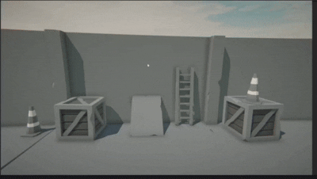

# Unity Modular Architecture Demo (MVP + Zenject)

This repository serves as a code example for a clean, scalable, and modular game architecture in Unity. It is built upon a foundation of **Zenject** for Dependency Injection, a UI-driven **MVP (Model-View-Presenter)** pattern, and a clear separation of concerns between **UI**, **Services**, and **Domain** logic.

The core philosophy is a UI-driven event flow, where user interactions (captured by Presenters) delegate complex gameplay logic to specialized Domain Controllers and reusable Services.

---

---

## 🏛️ Core Architectural Concepts

The project's logic flows primarily from user interaction, making the UI layer the starting point for most actions.

1.  **UI (MVP Layer):** The entire UI is built on an MVP (Model-View-Presenter) pattern.
    * **Views:** Simple `MonoBehaviour` components on GameObjects, responsible only for displaying data and capturing raw input events (e.g., button clicks).
    * **Presenters:** The "brain" of the UI. These are plain C# classes that bind to `Views`. They handle UI logic, manage state, and listen to user events. This project uses **UniRx** (or **R3**) and **UniTask** for powerful reactive and asynchronous programming in the Presenters.
    * **Models:** Data containers for the UI state.

2.  **Logic Flow (Presenter -> Controller):**
    * A `Presenter` captures a UI interaction (e.g., `OnBuyItemClicked`).
    * It does **not** contain the business logic itself. Instead, it calls the appropriate **Domain Controller** or **Service**.
    * Example: `_shopPresenter` calls `_shopController.PurchaseItem(itemId)` or `_currencyService.TrySpend(cost)`.

3.  **Domain (The "World" Logic):**
    * The `Domain/Controllers` folder contains the core gameplay logic. These are the main entities responsible for managing processes in the game world.
    * If the `Presenter` is the "conductor" for the UI, the `Controller` is the "conductor" for the game world itself.

4.  **Services (The Utility Belt):**
    * Services are designed as universal, reusable utilities. They are not tied to a specific feature but provide functionality that can be used from any part of the project (e.g., `ICurrencyService`, `IAudioService`).
    * They are bound via Zenject `Installers` and injected into `Presenters` and `Controllers` that need them.

## 📁 Project Structure

The project is organized into three primary directories: `Configs`, `Prefabs`, and `Scripts`.

### 1. Configs
This directory holds all `ScriptableObject`-based configurations, making the game deeply customizable without changing code.

* `HitHead/Assets/Game/Configs/`
    * **Enemies/**: Individual configuration files for different enemy types (stats, behavior, etc.).
    * **Weapons/**: Personal configs for each weapon, allowing for unique stats and feel.
    * **Resources/**: The main game configuration, controlling global balance, currency, in-game effects, and other core settings.

### 2. Prefabs
Contains all ready-to-use prefabs for the game. These assets have all their necessary scripts, components, and dependencies pre-configured.

### 3. Scripts
The heart of the project, containing all C# logic. The structure is designed to separate concerns clearly.

* `Scripts/`
    * **Camera/**: Manages all camera logic, controllers, and behaviors. It also provides essential references for other services that need camera data (e.g., effects, UI-to-world mapping).
    * **Domain/**: Contains the core game logic, completely independent of the UI.
        * `Controllers/`: Main entities that manage complex gameplay processes and state.
        * `Systems/`: Other domain-specific systems.
    * **Extensions/**: A collection of C# extension methods to simplify common tasks, especially for Zenject and other frameworks.
    * **Input/**: All input-related logic, built using **Unity's New Input System**. This includes input reading, action maps, and event dispatching.
    * **Installers/**: A centralized folder for all **Zenject** `MonoInstaller` and `ScriptableObjectInstaller` classes, which are responsible for binding all the dependencies for services, presenters, and controllers.
    * **Services/**: Contains the reusable, stateless utilities. These are typically interfaces (e.g., `ICurrencyService`) and their concrete implementations (e.g., `CurrencyService`).
    * **UI/**: Implements the **MVP (Model-View-Presenter)** architecture. This folder is further divided into sub-folders for each screen or major UI component (e.g., `MainMenu`, `HUD`, `Shop`), each containing its own `View` and `Presenter`.

## 💻 Tech Stack

* **Engine:** Unity 2022.3.58f1
* **Dependency Injection:** [Zenject](https://github.com/modesttree/Zenject)
* **UI Architecture:** MVP (Model-View-Presenter)
* **Asynchronous Programming:** [UniTask](https://github.com/Cysharp/UniTask)
* **Reactive Programming:** [UniRx](https://github.com/neuecc/UniRx) (or [R3](https://github.com/Cysharp/R3))
* **Input:** Unity's New Input System

## 🌱 Architectural Notes & Evolution

This project represents a specific snapshot of an evolving architecture. Some structural decisions were later refactored for even better modularity:

* **Installers:** The single `Installers` folder was later refactored. Installers are now co-located with their specific features/domains (e.g., `Scripts/UI/Shop/ShopInstaller.cs`) to improve modularity, with only global installers remaining at the top level.
* **Services:** Similarly, only truly global services (like `AudioService` or `SaveService`) remained in the `Services` folder. Feature-specific services were moved closer to their respective domain.

## 📞 Future Development & Contact

This project serves as a public code sample. Future projects and more advanced iterations will not be published publicly on GitHub.

To follow my professional journey and see development stages of my current projects, please connect with me on LinkedIn:

**[Connect with me on LinkedIn](https://www.linkedin.com/in/victor-kotik)**